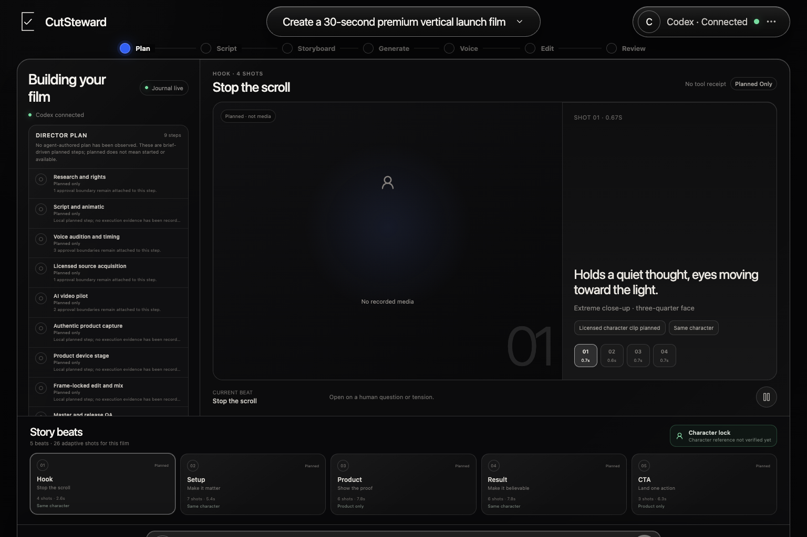
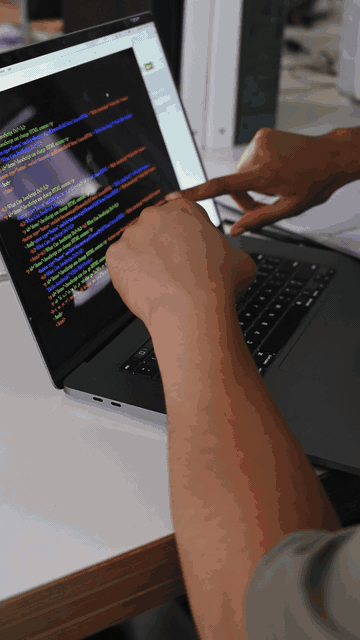

# CutSteward

**The governed AI video studio.**

[](https://github.com/mdshoebkhanking/cutsteward/actions/workflows/ci.yml)
[](LICENSE)
[](package.json)
[](docs/BOOTSTRAP.md)

**A local-first production cockpit that lets an AI agent help make the whole
video—while CutSteward keeps the plan, approvals, evidence, and final media
honest.**



CutSteward coordinates planning, research, rights-gated sourcing, generation,
voice, editing, browser supervision, QA, and delivery. A replaceable live agent
supplies production judgment; a durable kernel owns dependency state,
consequential approvals, provider receipts, content-addressed artifacts,
full-decode media evidence, and completion status. A plan, detected executable,
agent message, provider thumbnail, or successful process exit is never shown as
a finished video.

CutSteward is open source under the [MIT License](LICENSE) and deliberately
supports **macOS and Windows only** today.

The public-name collision screen and retained compatibility namespace are
documented in [the CutSteward brand decision](docs/BRAND_DECISION.md).

## Watch the demos

The two short launch films are English-first and designed for international
English-speaking audiences. They combine licensed internet stock, real
CutSteward interface artwork, restrained motion design, original project-authored
music, concise English on-screen copy, and verified final encoding. Both public
demos are intentionally music-led and contain no narration.

**Animated previews — click either preview to watch the full-quality MP4 with
music.**

<p align="center">
  <a href="demos/cutsteward-launch-demo-12s.mp4"></a>
</p>

<p align="center">
  <a href="demos/cutsteward-trust-demo-15s.mp4"></a>
</p>

| Demo | Format | What it proves |
| --- | --- | --- |
| [Production cockpit launch film](demos/cutsteward-launch-demo-12s.mp4) | 12s · 16:9 | Brief → visible production → exact approval → verified output |
| [Trust-first social short](demos/cutsteward-trust-demo-15s.mp4) | 15s · 9:16 | Fast short-form pacing, mobile UI proof, durable receipts, premium CTA |

Raw stock is not redistributed. Exact source pages, rendition hashes, creator
metadata when verified, and transformation rules are recorded in each demo's
manifest and in [THIRD_PARTY_NOTICES.md](THIRD_PARTY_NOTICES.md).

To reproduce the editable demo compositions after cloning, fetch the two exact
rights-recorded Pexels renditions and verify their SHA-256 hashes locally:

```sh
npm run demos:assets
```

The fetcher accepts only the allowlisted HTTPS media host, follows bounded
same-host redirects, refuses to replace a mismatched existing file, and stores
the raw sources only in Git-ignored demo asset folders.

## Why CutSteward is different

- **Bring a compatible agent.** Codex has a native app-server route; Gemini CLI,
  Hermes, and Kimi Code can use ACP when their installed runtime passes a real
  probe. Other agents can use the vendor-neutral folder/API handoff.
- **See the actual work.** Jobs, attempts, receipts, sources, media, and QA are
  durable product state—not optimistic chat text.
- **Approve the exact risk.** Upload, spend, stock selection, install, publish,
  and destructive boundaries fail closed and are bound to exact scopes.
- **Use real media tools.** FFmpeg, Blender, CapCut, supervised websites,
  Gemini/ElevenLabs voice, Veo/Flow generation, and stock providers enter through
  explicit adapters or reviewed handoffs.
- **Finish with evidence.** Frame/frame-rate/duration checks, full decode,
  perceptual review, hashes, and variant-specific QA determine release status.

## Start in one command

Install Node.js 22.12 or newer, open a terminal in this folder, then run:

```sh
npm run setup
```

The command installs locked local dependencies when needed, builds the app,
starts a loopback-only server, checks `/api/health`, attempts to open the default
browser, and always prints the exact URL. It is safe to run again.

Useful recovery commands:

```sh
npm run doctor
npm run status
npm run stop
```

Research and capability checks:

```sh
npm run tools:doctor
npm run tools:catalog
npm run agents:doctor
npm run agents:plan
npm run production:list
npm run browser:probe
```

To exercise the real evidence-gated production path without touching saved
runs, use `npm run production:smoke`. It starts an isolated loopback server,
generates and verifies a two-second local master, checks range playback and the
completion certificate, then removes its temporary data.

See [docs/BOOTSTRAP.md](docs/BOOTSTRAP.md) for Windows, macOS, agent
handoff, storage, and troubleshooting details.

For a complete media workstation setup, including declared CLI/app probes and
supported package-manager installs, use:

```sh
npm run setup:full
```

This can be large and may pause for an OS package manager, administrator rights,
license/login, or a desktop-only installer. See
[docs/MEDIA_TOOLCHAIN.md](docs/MEDIA_TOOLCHAIN.md).

The exact community CapCut integration is project-local and lockfile-pinned.
Agents must follow [docs/CAPCUT_AGENT_CONTRACT.md](docs/CAPCUT_AGENT_CONTRACT.md)
before touching a real draft.

Codex uses its native app-server transport. Gemini CLI, Hermes, and Kimi Code
use ACP when the installed executable passes the runtime probe. Claude Code,
Antigravity, and other local agents can still use the vendor-neutral folder/API
handoff. The UI labels a runner `connected` only after a real per-run session
receipt; detection is not connection. See
[docs/PRODUCTION_RUN_CONTRACT.md](docs/PRODUCTION_RUN_CONTRACT.md).

The execution layer includes typed adapters for ElevenLabs timed TTS, Google
Veo long-running video jobs, and rights-gated Pexels/Pixabay stock acquisition.
Its authoritative DAG snapshot, journal, approval decisions, and adapter
receipts are server-private under `.framepilot/data/.execution-state`, keyed by
an opaque run-and-plan hash rather than stored in the agent-writable project.
The cockpit exposes only a read projection. Workspace files that imitate the
old execution snapshot/journal names are ignored and never imported as
authority; upgrade materialization starts with approvals pending. Provider and
agent artifacts still resolve to the normal `projects/<run-id>` workspace.
Real external work still requires the relevant environment credential or a
supervised signed-in browser, an exact prepared request, user-owned
rights/consent, point-of-risk upload/spend/license approval, a provider receipt,
downloaded bytes, and media verification. Private provider endpoints are never
scraped and unavailable credentials remain visibly `configuration-required`.
The connected agent first writes the strict, credential-free parameters to the
run's `planning/PROVIDER_REQUESTS.json`. CutSteward derives an immutable action
hash and shows the complete request in the cockpit. Only the authenticated
local user can bind voice/likeness consent, third-party transfer, quota/spend,
or stock-license approval to that exact scope and action. A changed prompt,
voice, model, stock rendition, or plan invalidates the approval.

Agents can search the two admitted stock APIs without downloading anything:

```sh
npm run stock:search -- pexels real human commute
npm run stock:select -- pexels <cache-key> <asset-id> <rendition-id>
```

The search cache is private, encrypted, authenticated, bounded, and
restart-safe. Selection only returns exact candidate/provenance metadata; it is
not a license clearance, download, charge, or campaign-use approval.

Unknown websites use a dedicated headed Playwright profile. Navigation and
read-only inspection can be supervised. Every document, redirect, popup,
iframe, fetch, WebSocket, and subresource is checked before egress; service
workers are disabled, and DNS is resolved again on each request so loopback,
private, link-local, credentialed, file, and other non-HTTP(S) targets fail
closed. Each run is physically isolated under its own persistent-profile
namespace. The user personally handles
passwords, passkeys, MFA/OTP, CAPTCHA, account recovery, and browser security
warnings. The agent CLI is intentionally read-only (`navigate`, `snapshot`,
and bounded `wait`). Automated click/fill/download/upload, purchases or
credits, publishing, destructive actions, authentication, and local-network
access remain unavailable until a dedicated exact hash/scope-bound local-user
browser proposal service exists; use the visible browser manually for those
steps. Same-request booleans and page labels cannot grant authority. Cookies
and secrets are never exported to an agent or run journal. Browser evidence is
append-only and resumes one hash chain across browser restarts.

The audited `browser-use/video-use` source is pinned under
`.framepilot/tools/video-use` as a quarantined experimental speech-edit
adapter. `setup:full` idempotently admits only the exact reviewed commit and
runs its offline smoke test; `npm run video-use:install`,
`npm run video-use:doctor`, and `npm run video-use:smoke` are also available
separately. Passing quarantine does not grant cloud credentials or silently
activate it for production jobs.

The primary-source admission decisions behind the catalog are recorded in
[docs/GITHUB_MEDIA_ECOSYSTEM.md](docs/GITHUB_MEDIA_ECOSYSTEM.md), while agent
runtime/control choices are recorded in
[docs/GITHUB_AGENT_CONTROL_ECOSYSTEM.md](docs/GITHUB_AGENT_CONTROL_ECOSYSTEM.md).

## Product surfaces

- New project command composer
- Content-addressed local file sources and context-only URL references
- Plan/preflight and active run supervision
- Durable dependency execution, bounded fallback, restart reconciliation, and cancellation
- Codex/App Server plus ACP live-agent sessions
- Supervised website work with human takeover at authentication barriers
- Timed voice, long-running video, and licensed-stock provider seams
- Reviewed free-tool install plans with one-shot local-user approval
- Hash-bound upload, spend, rights, and external-action approvals
- Real local media playback with HTTP range support
- Final media review, immutable QA evidence, and certified delivery
- Recent runs, artifacts, runner/device health, and safe recovery

The sample film and run states are clearly marked local demonstrations. No
cloud upload, website action, rendering, or publishing occurs in demo mode.

New projects default to an English master for the US, Canada, UK, Australia,
New Zealand, and the wider English-speaking international market. The complete
portable production brain—including research, four script passes, character
reference strategy, stock-vs-generation routing, image-to-video continuity,
ElevenLabs/website operation, Blender device stages, captions, emotional voice,
micro-shot pacing, retries, QA, 4K classification, and delivery—is in
[UNIVERSAL_AI_VIDEO_AGENT_WORKFLOW.md](UNIVERSAL_AI_VIDEO_AGENT_WORKFLOW.md).
It is provider-agnostic, but it does not promise literal compatibility with
every future AI or website; new services enter through adapters or the
supervised-browser fallback.

The companion [clip and asset generation playbook](AI_CLIP_ASSET_GENERATION_PLAYBOOK.md)
details internet-stock routing, Gemini/Veo and other generation paths,
character-sheet continuity, image-to-video prompting, voice providers,
Blender/device stages, failure ladders, and per-asset evidence.
